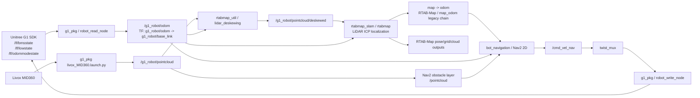
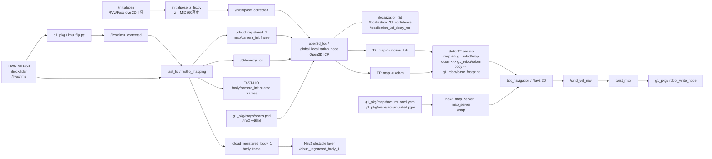

# 09 BotBrainmx2 旧2D定位导航 vs botbrain_ws_aitech 新3D定位+2D导航全景图

生成时间: 2026-07-08  
旧工程: `/Users/fausto/mdev/aitech/4g1edu/BotBrainmx2`，当前分支 `4g1edunnew`  
新工程: `/Users/fausto/mdev/aitech/4g1edu/botbrain_ws_aitech`，当前分支 `main`  
分析范围: 当前本地源码、`docker-compose.yaml`、G1 相关 launch/config/script，以及 `main` 分支 2026-07-07 的定位导航相关提交。

> 说明: 本文是静态代码与配置梳理，没有连接真实 G1 机器人做冷启动、定位收敛、导航实走验证。结论用于帮助新同事快速理解两代方案的架构差异、代码入口和维护边界。

---

## 1. 一句话结论

旧 `BotBrainmx2` 的 G1 方案是 **RTAB-Map LiDAR/ICP 定位 + RTAB-Map/地图管理 + Nav2 2D 导航** 的一体化旧链路，硬件里程计节点直接发布 `odom -> base_link`，RTAB-Map 负责把机器人放到 `map` 里。

新 `botbrain_ws_aitech` 的 G1 方案是 **FAST-LIO2 负责 LiDAR-IMU 里程计和点云，Open3D ICP 负责对 `scans.pcd` 做 3D 全局定位，Nav2 仍然负责 2D 路径规划和控制**。新版不是完整的 3D planner，也不是把机器人导航改成 3D 体素规划；它是把定位和地图基准升级成 3D，再把结果投影/桥接给 Nav2 2D 使用。

---

## 2. 新同事先记住的五个事实

1. **旧版主线看 `bot_localization`，新版主线看 `fast_lio + g1_pkg/localization_3d + open3d_loc`**  
   旧版 `localization` 容器启动 `ros2 launch bot_localization localization.launch.py`。新版 `fast_lio` 容器单独启动 `ros2 launch g1_pkg fast_lio.launch.py`，`localization` 容器通过 `/botbrain_ws/start_localization.sh` 启动 `ros2 launch g1_pkg localization_3d.launch.py`。

2. **新版导航仍是 Nav2 2D**  
   新版 `navigation` 容器仍启动 `ros2 launch bot_navigation navigation.launch.py`。`g1_pkg/config/nav2_params.yaml` 中 planner 是 `nav2_smac_planner/SmacPlanner2D`，controller 是 MPPI，costmap 是 2D costmap。所谓“3D”主要指定位、点云地图和障碍观测来源。

3. **新版的地图制品从单一 RTAB-Map DB 变成一组 3D+2D制品**  
   旧版 G1 maps 目录基本只有 `.gitkeep`，RTAB-Map DB 是旧链路的默认地图载体。新版 `g1_pkg/maps` 里同时有 `scans.pcd`、`accumulated.pgm`、`accumulated.yaml`、`rtabmap.db` 等，其中生产定位主入口是 `scans.pcd` + `accumulated.yaml/pgm`。

4. **新版 TF 主权从硬件 odom/RTAB-Map 迁到 FAST-LIO/Open3D 体系**  
   旧版 `g1_read.py` 发布完整 `odom -> base_link`，包含 z、roll、pitch、yaw。新版 `g1_read.py` 改为导航用 `base_footprint`、z 固定 0、只保留 yaw，并通过 `publish_tf` 参数允许关闭 TF。当前新版 `robot_interface.launch.py` 给 `robot_read_node` 传 `publish_tf: False`，避免和 3D 定位链路争抢主 TF。

5. **不要把新版 `tools/nav` 原型脚本当作唯一真相**  
   新版仓库里还有 `tools/nav/launch.sh`、`tools/mapping/*.sh` 等调试/原型脚本，里面使用过 `rmw_zenoh_cpp`、`rmw_zenohd` 和 `/g1_3d_nav_ros2` 路径。当前 `main` 的生产启动边界应以 `docker-compose.yaml`、`/botbrain_ws/start_localization.sh` 和 ROS launch 文件为准。

---

## 3. 两代方案全景图

### 3.1 旧版 BotBrainmx2: RTAB-Map 旧2D/平面导航链路



旧版的关键特点:

- `docker-compose.yaml` 的 `localization` 服务直接执行 `ros2 launch bot_localization localization.launch.py`。
- `bot_localization/launch/localization.launch.py` include `realsense.launch.py`、`rtabmap.launch.py`、`rtab_manager.launch.py`、`map_odom.launch.py`。
- `rtabmap.launch.py` 读取 `robot_config.yaml`，当 `robot_model == "g1"` 时进入 `rtabmap_lidar.launch.py`。
- `rtabmap_lidar.launch.py` 订阅 `/{namespace}/pointcloud` 和 `/{namespace}/odom`，使用 RTAB-Map 的 LiDAR ICP 参数做定位。
- `g1_read.py` 发布硬件 odom 和完整 TF: `odom -> base_link`，child frame 是 `base_link`。
- `bot_state_machine/config/navigation.json` 仍把 `rtab_manager`、`map_odom_node` 和 Nav2 lifecycle 节点放在同一个 navigation 管理链路里。

### 3.2 新版 botbrain_ws_aitech: FAST-LIO2 + Open3D ICP 3D定位，Nav2仍做2D导航



新版的关键特点:

- `docker-compose.yaml` 新增 `fast_lio` 服务，启动 `g1_pkg fast_lio.launch.py`。
- `docker-compose.yaml` 的 `localization` 服务改为执行 `/botbrain_ws/start_localization.sh`，最后 `exec ros2 launch g1_pkg localization_3d.launch.py`。
- `g1_pkg/launch/fast_lio.launch.py` 先启动 `imu_flip.py`，把倒装 MID360 的 IMU Y/Z 轴翻转到与 LiDAR 点云一致的坐标假设，再启动 `fastlio_mapping`。
- `fast_lio/config/mid360.yaml` 使用 `/livox/lidar`、`/livox/imu_corrected`，地图路径指向 `/botbrain_ws/src/g1_pkg/maps/scans.pcd`。
- `g1_pkg/launch/localization_3d.launch.py` 启动 `open3d_loc/global_localization_node`，默认 PCD 地图是 `scans.pcd`，默认 2D map 是 `accumulated.yaml`。
- `open3d_loc/src/global_localization.cpp` 订阅 `Odometry_loc`、`cloud_registered_1`、`initialpose`，发布 `localization_3d`、`localization_3d_confidence`、`localization_3d_delay_ms`、`baselink2map`、`odom2map`、`motionlink2map`，并发布 `map -> odom` 和 `map -> motion_link` 等 TF。
- `g1_pkg/scripts/grid_accumulator.py` 可把 FAST-LIO 全局点云投影/累计成 2D OccupancyGrid，配合 `map_saver_cli` 形成 `accumulated.pgm/yaml`。
- `g1_pkg/config/nav2_params.yaml` 仍是 Nav2 2D costmap；global/local costmap 的 `robot_base_frame` 都是 `<prefix>base_footprint`，障碍观测 topic 是 `/cloud_registered_body_1`。

---

## 4. 核心差异对比表

| 维度 | 旧 BotBrainmx2 | 新 botbrain_ws_aitech | 新同事要理解的含义 |
|---|---|---|---|
| 总体架构 | `bot_localization` 里 RTAB-Map 一体化承担定位/地图相关能力 | `fast_lio` 独立跑 LiDAR-IMU odom，`open3d_loc` 独立做 3D ICP 全局定位，`map_server` 独立发布 2D map | 新版拆成多进程多容器，定位链路更强，但启动时序和 TF 责任也更复杂 |
| 定位算法 | RTAB-Map LiDAR ICP，依赖硬件 odom 和点云 deskew | FAST-LIO2 做里程计与点云，Open3D ICP 对 `scans.pcd` 做全局配准 | 新版定位基准从 2D/RTAB-Map 体系迁到 3D PCD 体系 |
| 导航算法 | Nav2 2D | Nav2 2D | “3D定位 + 2D导航”，不是 3D全局规划 |
| Planner | `nav2_smac_planner/SmacPlanner2D` | `nav2_smac_planner/SmacPlanner2D` | 两代全局路径规划都是 2D |
| Controller | MPPI Controller | MPPI Controller，参数有降频、降速、Omni 模型等调参 | 新版主要是在适配足式机器人和 3D定位输出稳定性 |
| 地图主制品 | RTAB-Map DB，G1 maps 目录本地只有 `.gitkeep` | `scans.pcd` + `accumulated.pgm/yaml`，另保留 `rtabmap.db` | 新版地图维护必须同时考虑 3D PCD 和 2D Nav2 map |
| 2D map 来源 | RTAB-Map/legacy map 管理链路 | `grid_accumulator.py` 从 FAST-LIO 点云投影累计，保存成 `accumulated.pgm/yaml`，运行时由 `map_server` 发布 `/map` | 新版 2D map 是 3D点云地图的导航投影，不应手工随意替换其中一个文件 |
| odom 来源 | `robot_read_node` 从 `/lf/odommodestate` 发布 `/{prefix}/odom`，并发布 TF | FAST-LIO 发布 `/Odometry_loc`，硬件 odom 仍可发布 topic，但 TF 被关闭 | Nav2 看到的主定位应来自 3D定位链路，而不是硬件 odom 抢 TF |
| base frame | `base_link` | `base_footprint`，并通过 static TF 连接到 `body` 等 3D frame | 新版为 2D Nav2 提供地面投影底盘坐标，减少 pitch/roll/z 对 2D 导航的污染 |
| TF 主链 | `map -> odom -> base_link`，其中 `odom -> base_link` 由 `g1_read.py` 发布，`map -> odom` 来自 RTAB/legacy | `map -> odom`、`map -> motion_link` 来自 Open3D ICP；`body -> g1_robot/base_footprint`、`map/odom` namespace alias 由 static TF 桥接 | 新版 TF 不能再让多个节点同时发布同一条主链，否则 Nav2 会跳变或不可用 |
| initial pose | 常规 2D `/initialpose` 更贴近旧平面定位假设 | `/initialpose` 先经 `initialpose_z_fix.py` 修正 z 到 MID360 高度，再送 `/initialpose_corrected` 给 ICP | Foxglove/RViz 2D工具发的是 z=0，新版 3D ICP 需要正确高度 |
| 障碍观测 | Nav2 costmap 读 `/pointcloud` | Nav2 costmap 读 `/cloud_registered_body_1` | 新版动态障碍来源更贴近 FAST-LIO 的 body frame 点云 |
| 动态噪声处理 | 主要依赖 RTAB-Map/pointcloud/costmap 参数 | `grid_accumulator.py` 增加 `min_obs_hits`，点云累计时多次命中才标障碍 | 新版建 2D map 时显式减少行人/噪声误标 |
| lifecycle 管理 | `bot_state_machine/config/navigation.json` 管 `rtab_manager`、`map_odom_node` 和 Nav2 lifecycle 节点 | `rtab_manager`、`map_odom_node` 放入 `_disabled_legacy_nodes`，Nav2 lifecycle 节点放入 `_disabled_nav2_managed_nodes`，由 Nav2 自己的 lifecycle manager 管 | 新版避免状态机重复管理 Nav2/legacy 节点，减少生命周期冲突 |
| 摄像头位置 | `bot_localization/localization.launch.py` include RealSense | `g1_pkg/localization_3d.launch.py` 仍 include RealSense，并由 `start_localization.sh` 加 lifecycle auto-activation guard | 摄像头画面当前仍与 localization 容器耦合，这是昨天开机自启动问题的一条重要背景 |
| 调试关注点 | `/g1_robot/odom`、`/g1_robot/pointcloud`、RTAB-Map topic、`map->odom`、Nav2 costmap | `/livox/imu_corrected`、`/Odometry_loc`、`/cloud_registered_1`、`/cloud_registered_body_1`、`/localization_3d_confidence`、TF、`/map` | 新版排障顺序必须先看 3D定位链路，再看 Nav2 |

---

## 5. 为什么要从旧2D链路升级到3D定位链路

G1 是双足机器人，不是稳定平面轮式底盘。它在行走、转身、站姿调整时会有明显的 pitch/roll/z 变化，硬件里程计和 IMU 姿态会把这些运动带到 `base_link`。旧版把完整 `odom -> base_link` 直接交给 RTAB-Map/Nav2，容易出现几个问题:

- `base_link` 有 roll/pitch/z 抖动，Nav2 2D costmap 和 planner 实际只需要地面投影，过多 3D姿态会污染 2D导航假设。
- RTAB-Map 在 G1 路径中虽然用 LiDAR ICP，但它同时承担定位/数据库/地图管理，调试边界混在一起。
- 走廊、开阔区域、转弯时，单靠旧的 RTAB-Map 参数和硬件 odom 更容易漂移或恢复慢。
- 地图制品不清晰，旧 G1 maps 目录本地没有成套 PCD + PGM/YAML，换地图、复现实验、给新人交接都困难。

新版采用 FAST-LIO2 + Open3D ICP 的原因:

- FAST-LIO2 更适合使用 MID360 LiDAR + IMU 做高频局部里程计，能输出连续点云和里程计。
- Open3D ICP 对离线 `scans.pcd` 做全局/局部 3D配准，可以把机器人放回真实 3D结构地图中。
- Nav2 仍保持 2D，因为当前机器人执行层最终还是接受地面速度控制，任务路径也主要发生在可通行地面平面。
- 把 3D定位和 2D导航解耦后，定位可用 3D结构提升鲁棒性，导航仍保留 Nav2 生态、BT、costmap、controller 等成熟能力。

---

## 6. 昨天 main 分支修改暴露出的关键差异

2026-07-07 的提交不是单纯“调参数”，它们集中暴露了两代架构的根本差异:

| 提交 | 与本文相关的变化 | 说明 |
|---|---|---|
| `6a72903` | 调整 `localization_3d.launch.py`、FAST-LIO 参数、Nav2 参数，新增 `localization_monitor.py`、`initialpose_z_fix.py` | 新版定位需要处理 3D ICP 频率、fitness、初始位姿 z、高度桥接、Nav2 降速等问题，复杂度明显高于旧 RTAB-Map 单链路 |
| `92a2153` | `grid_accumulator.py` 增加 `min_obs_hits` | 新版从 3D点云投影 2D地图时，要显式处理动态行人和点云噪声，否则会把临时障碍固化进 2D map |
| `db20e04` | `fast_lio/config/mid360.yaml` 改为使用 `scans.pcd`、`/livox/imu_corrected`，调整 voxel、iteration、IMU covariance 等 | 新版定位质量高度依赖 MID360 安装方向、IMU坐标、FAST-LIO收敛和 PCD地图一致性 |
| `098ac8b` | `localization_3d.launch.py` 接入 RealSense，新增/复制 `g1_pkg/scripts/fast_lio.launch.py`，调整 `grid_accumulator` z显示偏移，`docker-compose.yaml` 的 localization 改用 `/botbrain_ws/start_localization.sh` | 摄像头画面被挂在 3D localization 容器里，说明“D435i浏览器画面”和“3D定位服务”当前存在运行耦合 |
| `0694efe` | `start_localization.sh` 增加 camera lifecycle auto-activation guard | 说明 lifecycle 时序已经成为新版多容器多节点架构的实际问题 |
| `d6f8f33` | 新增 `mxdocs/08-boot-jtop-d435i-root-cause-and-best-practice-20260708.md` | 上一份文档聚焦开机自启动、jtop、D435i；本文聚焦两代定位导航架构差异 |

---

## 7. 新同事看代码的入口

### 7.1 旧 BotBrainmx2 入口

| 目标 | 文件 |
|---|---|
| 容器入口 | `docker-compose.yaml` |
| localization 服务 | `botbrain_ws/src/bot_localization/bot_localization/launch/localization.launch.py` |
| 根据 robot_model 选择 RTAB-Map 路径 | `botbrain_ws/src/bot_localization/bot_localization/launch/rtabmap.launch.py` |
| G1 LiDAR RTAB-Map ICP | `botbrain_ws/src/bot_localization/bot_localization/launch/rtabmap_lidar.launch.py` |
| G1 硬件接口 | `botbrain_ws/src/g1_pkg/launch/robot_interface.launch.py` |
| G1 odom/imu/tf 发布 | `botbrain_ws/src/g1_pkg/scripts/g1_read.py` |
| G1 Nav2 参数 | `botbrain_ws/src/g1_pkg/config/nav2_params.yaml` |
| navigation 状态机 | `botbrain_ws/src/bot_state_machine/config/navigation.json` |

### 7.2 新 botbrain_ws_aitech 入口

| 目标 | 文件 |
|---|---|
| 容器入口 | `docker-compose.yaml` |
| localization shell 入口 | `botbrain_ws/start_localization.sh` |
| FAST-LIO 启动 | `botbrain_ws/src/g1_pkg/launch/fast_lio.launch.py` |
| FAST-LIO 参数 | `botbrain_ws/src/fast_lio/config/mid360.yaml` |
| 3D定位启动 | `botbrain_ws/src/g1_pkg/launch/localization_3d.launch.py` |
| Open3D ICP 主实现 | `botbrain_ws/src/open3d_loc/src/global_localization.cpp` |
| 2D地图累计 | `botbrain_ws/src/g1_pkg/scripts/grid_accumulator.py` |
| G1 硬件接口 | `botbrain_ws/src/g1_pkg/launch/robot_interface.launch.py` |
| G1 odom/imu/topic 发布 | `botbrain_ws/src/g1_pkg/scripts/g1_read.py` |
| G1 Nav2 参数 | `botbrain_ws/src/g1_pkg/config/nav2_params.yaml` |
| navigation 状态机 | `botbrain_ws/src/bot_state_machine/config/navigation.json` |
| Foxglove topic 白名单 | `botbrain_ws/src/bot_bringup/config/foxglove_bridge_params.yaml` |
| 地图制品 | `botbrain_ws/src/g1_pkg/maps/scans.pcd`、`accumulated.pgm`、`accumulated.yaml` |

---

## 8. 新版运行链路按层拆解

### 8.1 传感器层

输入:

- MID360 LiDAR: `/livox/lidar`
- MID360 IMU: `/livox/imu`
- RealSense D435i: 由 `bot_localization/realsense.launch.py` 启动，当前 include 在 `g1_pkg/localization_3d.launch.py`
- Unitree G1 低层状态: `/lf/bmsstate`、`/lf/lowstate`、`/lf/odommodestate`

新版关键点:

- `imu_flip.py` 输出 `/livox/imu_corrected`，FAST-LIO 使用修正后的 IMU。
- `robot_read_node` 仍发布电池、关节、IMU、odom topic，但默认不再掌握导航主 TF。

### 8.2 FAST-LIO2 层

入口:

- `g1_pkg/launch/fast_lio.launch.py`
- `fast_lio/config/mid360.yaml`

输入:

- `/livox/lidar`
- `/livox/imu_corrected`

输出:

- `/Odometry_loc`
- `/cloud_registered_1`
- `/cloud_registered_body_1`
- path、map cloud、scan cloud 等 FAST-LIO topic

定位含义:

- 这一层提供连续、高频的 LiDAR-IMU odom 和点云。
- 它不是最终全局定位闭环；全局修正由 Open3D ICP 对 PCD 地图完成。

### 8.3 Open3D ICP 3D定位层

入口:

- `g1_pkg/launch/localization_3d.launch.py`
- `open3d_loc/src/global_localization.cpp`

输入:

- 3D PCD 地图: `/botbrain_ws/src/g1_pkg/maps/scans.pcd`
- FAST-LIO odom: `Odometry_loc`
- FAST-LIO 全局点云: `cloud_registered_1`
- 初始位姿: `/initialpose` -> `initialpose_z_fix.py` -> `/initialpose_corrected`

输出:

- `/localization_3d`
- `/localization_3d_confidence`
- `/localization_3d_delay_ms`
- `/baselink2map`
- `/odom2map`
- `/motionlink2map`
- TF: `map -> odom`
- TF: `map -> motion_link`

质量判断:

- 先看 `/localization_3d_confidence` 是否稳定。
- 再看 `/localization_3d_delay_ms` 是否持续过大。
- 再看 `map -> odom` 是否跳变、是否有 NaN/Inf。
- 最后才看 Nav2 planner/controller 行为。

### 8.4 2D地图与 Nav2 层

入口:

- `g1_pkg/maps/accumulated.yaml`
- `g1_pkg/maps/accumulated.pgm`
- `g1_pkg/config/nav2_params.yaml`
- `bot_navigation/navigation.launch.py`

运行时:

- `localization_3d.launch.py` 启动 `nav2_map_server/map_server` 发布 `/map`。
- Nav2 global costmap static layer 订阅绝对 topic `/map`。
- Nav2 obstacle layer 使用 `/cloud_registered_body_1`。
- Nav2 global/local frame 使用 `<prefix>map`、`<prefix>base_footprint`。

维护含义:

- `scans.pcd` 是 3D ICP 的定位基准。
- `accumulated.yaml/pgm` 是 Nav2 的 2D规划基准。
- 两者必须来自同一套建图过程或经过严格对齐；只替换其中一个会导致“3D定位看似对，Nav2地图不对”或“Nav2地图对，ICP定位偏”的问题。

---

## 9. TF 主权和 frame 变化

### 9.1 旧版 TF 思路

旧版 `g1_read.py`:

- `odom.header.frame_id = f'{prefix}odom'`
- `odom.child_frame_id = f'{prefix}base_link'`
- `odom.pose.pose.position.z = msg.position[2]`
- orientation 直接复制完整 IMU quaternion
- 每帧发布 TF `odom -> base_link`

旧版适合轮式或稳定底盘的简单 2D导航假设，但对于 G1 双足机器人，完整 pitch/roll/z 很容易进入 2D Nav2 链路。

### 9.2 新版 TF 思路

新版 `g1_read.py`:

- 新增 `publish_tf` 参数。
- `nav_base_frame = 'base_footprint'`。
- odom child frame 改为 `<prefix>base_footprint`。
- odom z 固定为 `0.0`。
- orientation 只从 IMU quaternion 中提取 yaw，再构造 yaw-only quaternion。

新版 `robot_interface.launch.py`:

- 给 `robot_read_node` 传 `publish_tf: False`。

新版 `localization_3d.launch.py`:

- `open3d_loc` 发布 `map -> odom`。
- static TF 桥接普通 `map/odom/body` 到 `g1_robot/map`、`g1_robot/odom`、`g1_robot/base_footprint`。
- `body -> g1_robot/base_footprint` 使用 z 偏移，把 IMU/body 高度投影到地面 base footprint。

维护原则:

1. 同一条 TF 边只能有一个发布者。
2. Nav2 需要稳定的平面 base frame，应使用 `base_footprint` 而不是带 pitch/roll/z 抖动的 `base_link`。
3. 3D定位可以维护 `body`、`motion_link`、`base_link` 等真实空间关系，但交给 Nav2 的 frame 必须清晰、稳定、可查。
4. 如果出现 TF 抖动、跳变、frame 不存在，优先查 `robot_read_node publish_tf` 是否误开、Open3D ICP 是否发布 NaN/Inf、static TF alias 是否重复或方向错误。

---

## 10. 地图制品和更新流程差异

### 10.1 旧版地图

旧版 `BotBrainmx2/botbrain_ws/src/g1_pkg/maps` 当前本地只有 `.gitkeep`。旧链路从代码看默认地图名是 `rtabmap.db`，由 `rtabmap.launch.py` 根据 robot package 拼出:

```text
botbrain_ws/src/<robot_package>/maps/<default_map>
```

对于 G1，RTAB-Map LiDAR 路径会拿这个 database path 做定位/地图数据库入口。

### 10.2 新版地图

新版 `botbrain_ws_aitech/botbrain_ws/src/g1_pkg/maps` 当前有:

```text
scans.pcd
accumulated.pgm
accumulated.yaml
fixed_map.pgm
fixed_map.yaml
office1.pgm
office1.yaml
rtabmap.db
```

生产主链路更重要的是:

- `scans.pcd`: Open3D ICP 的 3D点云地图。
- `accumulated.pgm`: Nav2 2D地图图像。
- `accumulated.yaml`: Nav2 2D地图元数据，`map_server` 读取它发布 `/map`。

`rtabmap.db` 仍在目录中，但当前 `main` 的 3D定位生产入口不是从 RTAB-Map DB 启动。

### 10.3 新版建图/换图最佳实践

换地图时必须把下面三件事当成一个版本:

1. `scans.pcd`
2. `accumulated.pgm`
3. `accumulated.yaml`

建议流程:

1. 用 FAST-LIO 在目标场地采集一套稳定点云，保存 3D PCD。
2. 用同一套轨迹和同一套高度/阈值参数运行 `grid_accumulator.py`，生成 `/accumulated_grid`。
3. 用 `nav2_map_server map_saver_cli` 保存 `accumulated.pgm/yaml`。
4. 在 RViz/Foxglove 中同时检查 PCD、2D map、TF、机器人 footprint 是否对齐。
5. 记录地图生成参数: 分辨率、`ground-z-min`、`ground-z`、`obstacle-z`、`obstacle-z-max`、`min_obs_hits`、`map-z`、传感器安装高度。
6. 把 `scans.pcd`、`accumulated.pgm`、`accumulated.yaml` 作为同一批次提交或发布，不要单独替换。

---

## 11. 排障顺序: 新版不要按旧版思路查

### 11.1 旧版常见排障顺序

1. `robot_read_node` 是否 active。
2. `/g1_robot/odom` 是否有数据。
3. TF `g1_robot/odom -> g1_robot/base_link` 是否存在。
4. `/g1_robot/pointcloud` 是否有数据。
5. RTAB-Map 是否收到 odom 和 scan cloud。
6. `map -> odom` 是否存在。
7. Nav2 costmap 是否订阅 `/pointcloud` 并更新。

### 11.2 新版常见排障顺序

1. `fast_lio` 容器是否运行。
2. `/livox/lidar` 是否有数据。
3. `/livox/imu_corrected` 是否有数据，且 IMU方向没有倒置。
4. `/Odometry_loc` 是否连续。
5. `/cloud_registered_1` 是否连续。
6. `open3d_loc/global_localization_node` 是否加载到正确的 `scans.pcd`。
7. `/localization_3d_confidence` 是否达到可用阈值并稳定。
8. `/localization_3d_delay_ms` 是否合理。
9. TF `map -> odom`、`map -> motion_link` 是否存在且不跳变。
10. static TF alias 是否让 Nav2 能查到 `<prefix>map -> <prefix>base_footprint`。
11. `/map` 是否由 map_server 发布，内容是否来自当前地图的 `accumulated.yaml`。
12. Nav2 global/local costmap 是否收到 `/cloud_registered_body_1`。
13. 最后再查 planner/controller 参数。

排障时不要一上来只看 Nav2 报错。新版 Nav2 的许多失败只是上游 3D定位、TF、地图对齐问题的结果。

---

## 12. 维护边界和行业最佳实践建议

### 12.1 明确分层责任

建议把新版 G1 栈按以下边界维护:

| 层 | 责任 | 不应承担的责任 |
|---|---|---|
| 传感器层 | 提供 Livox、IMU、RealSense、Unitree 状态 topic | 不发布全局定位结论 |
| FAST-LIO2 | 提供 LiDAR-IMU odom 和局部/全局点云 | 不直接替代全局地图定位质量判断 |
| Open3D ICP | 对 3D PCD 做全局定位，发布定位质量和 `map -> odom` | 不管理 Nav2 lifecycle，不直接控制机器人 |
| Map Server | 发布 Nav2 使用的 2D `/map` | 不参与 3D ICP |
| Nav2 | 做 2D路径规划、2D costmap、控制输出 | 不重新定义主 TF，不修正 3D定位漂移 |
| State Machine | 管理业务节点和少数非 Nav2 lifecycle 工具 | 不重复管理 Nav2 自己的 lifecycle，不复活 legacy RTAB节点 |

### 12.2 TF 主权只能有一个

新版中必须避免这些情况:

- `g1_read.py` 和 Open3D/FAST-LIO 同时发布影响 Nav2 的 `odom -> base_*` 主链。
- RTAB-Map legacy `map_odom_node` 和 Open3D ICP 同时发布 `map -> odom`。
- static TF alias 方向错，导致 Nav2 查 frame 时形成环或断链。

建议每次改 TF 后执行:

```bash
ros2 run tf2_tools view_frames
ros2 run tf2_ros tf2_echo map odom
ros2 run tf2_ros tf2_echo g1_robot/map g1_robot/base_footprint
```

### 12.3 地图版本必须成组管理

建议建立地图目录规范:

```text
maps/
  hall_20260708/
    scans.pcd
    accumulated.pgm
    accumulated.yaml
    metadata.md
```

`metadata.md` 至少记录:

- 建图日期、机器人、传感器安装高度。
- FAST-LIO 配置版本。
- grid accumulator 参数。
- 是否有人流、玻璃、反光、窄通道等特殊环境。
- 现场起点和坐标系说明。
- 验证结果: ICP confidence、Nav2 路径通过区域、失败区域。

### 12.4 初始位姿入口要统一

新版 3D ICP 需要正确 z。Foxglove/RViz 的 2D Pose Estimate 通常只给地面平面的 x/y/yaw，z 是 0。因此:

- 对操作者暴露 `/initialpose`。
- 内部通过 `initialpose_z_fix.py` 修正为 MID360/IMU 高度。
- Open3D ICP 订阅 `/initialpose_corrected`。

不要让不同工具有的发 `/initialpose`，有的直接发 `/initialpose_corrected`，否则现场调试会出现“同样点位，有时能收敛，有时完全不对”的问题。

### 12.5 摄像头服务建议从定位链路解耦

当前新版 `localization_3d.launch.py` include RealSense，`start_localization.sh` 又加了 camera lifecycle auto-activation guard。这解释了为什么昨天修 D435i 浏览器画面时，会牵连 localization 容器。

从工程边界看，浏览器看 D435i 画面不应依赖 Open3D ICP、FAST-LIO、PCD地图或 Nav2。更合理的长期方向:

- 单独建立 `camera` 或 `sensing` launch/service，负责 RealSense lifecycle 和 compressed image。
- localization 只依赖必要传感器 topic，不负责“为了前端画面”拉相机。
- state_machine 不要一次性扫描后就永久跳过晚出现的 lifecycle 节点，应支持等待、重试和状态自愈。

这部分已经在 `08-boot-jtop-d435i-root-cause-and-best-practice-20260708.md` 中从开机自启动角度展开，本文只强调它与新版定位架构的耦合关系。

### 12.6 生产入口以 compose 和 launch 为准

当前 `main` 下应以这条链路为生产真相:

```text
docker-compose.yaml
  fast_lio -> ros2 launch g1_pkg fast_lio.launch.py
  localization -> /botbrain_ws/start_localization.sh -> ros2 launch g1_pkg localization_3d.launch.py
  navigation -> ros2 launch bot_navigation navigation.launch.py
```

`tools/nav/launch.sh`、`tools/mapping/*.sh` 可以作为调试资料，但不要在新人交接或故障排查时把它们当作当前生产系统的唯一入口。

---

## 13. 新同事快速判断: 我现在看到的是哪条链路

在机器人或容器里看这些现象:

| 现象 | 说明 |
|---|---|
| `localization` 容器命令是 `ros2 launch bot_localization localization.launch.py` | 更像旧 RTAB-Map 链路 |
| 有独立 `g1_robot_fast_lio` 容器 | 新 FAST-LIO2 链路 |
| 看到 `/Odometry_loc`、`/cloud_registered_1`、`/localization_3d_confidence` | 新 3D定位链路 |
| Nav2 costmap obstacle topic 是 `/pointcloud` | 更像旧 G1 Nav2 配置 |
| Nav2 costmap obstacle topic 是 `/cloud_registered_body_1` | 新 G1 Nav2 配置 |
| `robot_base_frame` 是 `base_link` | 旧配置或未完成迁移 |
| `robot_base_frame` 是 `<prefix>base_footprint` | 新配置 |
| `bot_state_machine/config/navigation.json` 还 active 管 `rtab_manager`、`map_odom_node` | 旧状态机管理方式 |
| `rtab_manager`、`map_odom_node` 在 `_disabled_legacy_nodes` | 新状态机管理方式 |

---

## 14. 最终建议

1. 对外介绍新版时，统一说法应是: **3D定位 + 2D导航**。不要说成“已经是 3D导航”，避免误导同事去查不存在的 3D planner。

2. 新人排查定位导航问题时，先画清楚三条线:
   - FAST-LIO2 线: `/livox/lidar` + `/livox/imu_corrected` -> `/Odometry_loc` + 点云。
   - Open3D ICP 线: `scans.pcd` + `/Odometry_loc` + `/cloud_registered_1` -> `/localization_3d` + `map -> odom`。
   - Nav2 线: `/map` + `/cloud_registered_body_1` + `<prefix>base_footprint` TF -> `/cmd_vel_nav`。

3. 所有地图更新必须把 `scans.pcd` 和 `accumulated.pgm/yaml` 当作同一版本发布。

4. 所有 TF 修改必须明确主权，禁止 legacy RTAB-Map、硬件 odom、Open3D ICP 同时发布同一段主 TF。

5. 摄像头、jtop、健康信息等前端展示能力应逐步从 localization 定位链路里拆出来，变成独立 sensing/health 服务；定位失败不应导致浏览器摄像头画面失败。

6. 当前 `botbrain_ws_aitech/main` 的定位导航生产链路已经不同于 `BotBrainmx2`，后续不要继续把旧 `bot_localization` RTAB-Map G1 路径和新版 FAST-LIO/Open3D 路径混用。保留旧代码可以作为 fallback 或参考，但不能让两个体系同时管理 `map/odom/base`。
